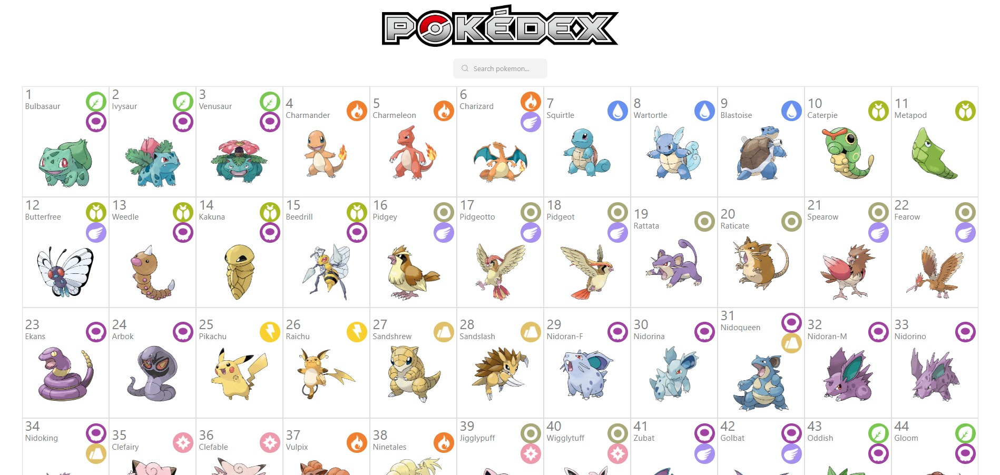
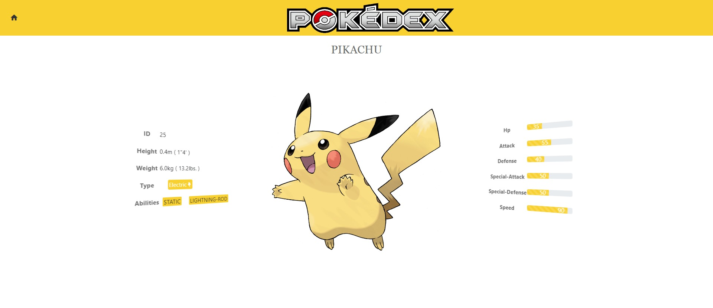

PokéAngular es una aplicación web desarrollada con Angular con TypesScript  que muestra información sobre los diferentes Pokémon. Puedes explorar la lista de Pokémon, ver detalles de cada uno y buscar Pokémon específicos.




## Instalación

1. Clona este repositorio en tu máquina local.
2. Asegúrate de tener Node.js y Angular CLI instalados en tu sistema.
3. Abre una terminal en el directorio raíz del proyecto.
4. Ejecuta el siguiente comando para instalar las dependencias:

   ```shell
   npm install


## USO

1. Después de instalar las dependencias, ejecuta el siguiente comando para iniciar la aplicación:

   ```shell
   ng serve


2. Abre tu navegador web y navega a http://localhost:4200/. La aplicación se cargará automáticamente y podrás ver la página de inicio.


## CARACTERISTICAS

- Lista de Pokémon: Explora una lista completa de todos los Pokémon disponibles.
- Detalles del Pokémon: Ver información detallada sobre cada Pokémon, como tipo, habilidades, estadísticas, etc.
- Búsqueda: Busca Pokémon específicos por nombre o número de Pokédex.
- Interfaz intuitiva: Diseño limpio y fácil de usar.


## CONTRIBUCIÓN
Si deseas contribuir a este proyecto, sigue los pasos a continuación:

1. Realiza un fork de este repositorio.
2. Crea una rama con la siguiente convención de nombres: feature/nombre-de-la-funcionalidad o bugfix/nombre-del-bug.
3. Realiza los cambios necesarios en tu rama.
4. Envía un pull request a la rama principal.


## LICENCIA
Este proyecto está bajo la Licencia MIT.

## CONTACTO
Si tienes alguna pregunta o sugerencia, no dudes en ponerte en contacto conmigo en https://www.linkedin.com/in/isabelrebollo/ 

